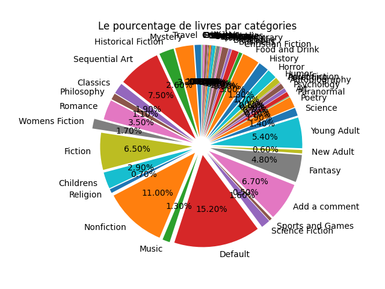
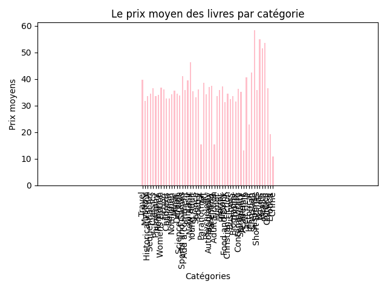

# Web scrapping sur le site BooksToScrap

Ce projet est un exercice de web scrapping avec l'utilidation du langage python et BeautifulSoup afin de récolter les données du site https://books.toscrape.com/index.html . Dans un premier tempsn je récupère un maximum de données concernants tous les livres de toutes les catégories que nous allons par le suite stocker dans un fichier csv. Ce dernier nous permettra de générer des graphiques à partir du nombre de livres et la moyenne de ceci. Enfin, à partir de ces graphiques nous entirerons des fichier pdf explicatif. 

## Pré-requis

Avant d'installer ce projet, il est requis d'avoir instller sur votre machine : 
- Pyhton via https://www.python.org/downloads/

## Installation 
Dans un premier temps commencer par cloner le projet sur github. 
Une fois les pré-requis complétés et le projet cloné, 
il est fortment recommandé d'activer/créer votre environnement virtuel avec les commandes : 
 ##### Pour créer un environement virtuel 
 >python -m venv env
 ##### Pour activer votre environnement virtuel
 ###### * Sur window
 >env\Scripts\activate
 ###### * Sur mac/linux
 >source env/bin/activate

Puis, installez toutes les dépendances reliées aux projet à partir du fichier requirements.txt en tapant la commande : 
 > pip install -r requirements.txt

 À ce niveau, vous êtes prêt à prendre en main le projet ! 

 ## Reste à faire 
 Une fois toutes les étapes précédentes passées n'oubliez pas de créer un fichier .gitignore dans lequel vous inscriverez le nom des dossiers/fichier sensible tel que le dossier env.

## Bon à savoir 

Un peu plus en détails, ce projet a initiallement été décomposé en 6 étapes. 
Logique de réalisation des 6 étapes : 
- Les trois premières ont été réalisées et push sur git à partir du fichier render.py 
- Ensuite, de l'étape quatre à la dernière, chacune d'elle ont été réalisées dans un fichier dédié :
    -   Étape 4 : scrapping_booktoscrappe.py
    <b> Objectif </b>: scrapper près de dix informations de tous les livres sur chaque page de toutes les catégories puis les stocker dans un fichier csv
    -   Étape 5 : matplotlib_graph.py
     <b> Objectif </b>: À partir des données du fichier csv calculer le pourcentage de livre par catégories puis la moyenne des prix des livres par catégories et, respectivement, en faire un diagramme circulaire et un graphique en barre
    -   Érape 6 : reportLab_pdf.py
    <b> Objectif </b>: À partir des graphiques produits, générer un fichier pdf qui les recense.

## Informations additionnelles

Pour avoir un visuelle sur les graphiques : 
- Voici le graphique circulaire :

- voici le graphique en barre 

